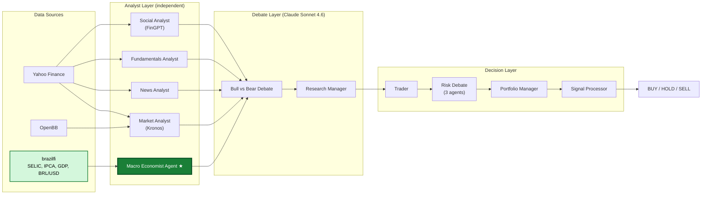

# Autonomous Hedge Fund: multi-agent LLM trading system

> Does explicit macroeconomic reasoning matter more for LLM trading agents in emerging markets than in developed ones? This is an independent research project that extends the TradingAgents framework with an original Macro Economist Agent and a 2×2 factorial experiment to test that hypothesis.

[](https://github.com/RAFAELDCOELHO/autonomous-hedge-fund/actions/workflows/tests.yml)
[](LICENSE)
[](pyproject.toml)

## The research question

TradingAgents (arXiv:2412.20138) coordinates four analyst agents (technical, sentiment, news, and fundamentals), but none of them consumes explicit macroeconomic indicators such as interest rates, inflation, or exchange rates as structured inputs. In developed markets this omission is defensible: the US Federal Funds Rate moved between 0% and 5.5% over the past decade. In emerging markets it is a potential blind spot. The Brazilian SELIC rate moved between 2% and 14.25% in the same period, with multiple 300–500 basis-point swings inside single 12-month windows. Swings of that size dominate equity pricing through credit costs, fixed-income competition, and currency effects on exporters.

**Hypothesis (H1):** Adding a Macro Economist Agent that consumes structured macroeconomic data (interest rates, inflation, GDP growth, exchange rates) improves trading performance, measured by Sharpe ratio and cumulative return, significantly more in emerging markets than in developed markets, due to the asymmetry in macroeconomic volatility.

This hypothesis is tested with a 2×2 factorial design: Market (US vs. Brazil) × Macro Agent (absent vs. present).

## Architecture



★ The Macro Economist Agent is the original contribution. It queries four LangChain tools backed by [brazilfi](https://pypi.org/project/brazilfi/): `get_selic`, `get_inflation`, `get_gdp`, and `get_exchange_rate`. Before the debate begins, it writes a structured macro report into the shared agent state. The agent is opt-in via `selected_analysts`, which preserves the original paper's baseline and enables the factorial design.

## Stack

| Layer | Technology |
|-------|------------|
| LLM backbone | Claude Sonnet 4.6 (reasoning, debate) + Claude Haiku 4.5 (fast tasks) |
| Time series | Kronos-small (AAAI 2026) |
| Sentiment | FinGPT v3 methodology |
| Macro data | brazilfi (Bacen, IBGE, Tesouro Direto, B3 — typed Python SDK) |
| Market data | Yahoo Finance + OpenBB |
| Orchestration | LangGraph StateGraph, ~17–25 LLM calls per trading day |
| Language | Python 3.12 |

## Original contribution

**From TradingAgents (Xiao et al., 2024):**
- Multi-agent debate structure (Bull/Bear, risk debate)
- LangGraph orchestration pattern
- Four-analyst layer architecture (Market, Social, News, Fundamentals)

**Original in this fork:**
- Macro Economist Agent: a fifth analyst that consumes structured Brazilian macro data (SELIC, IPCA, GDP, BRL/USD)
- brazilfi integration: an agent tool layer built on a typed SDK for Bacen/IBGE/Tesouro/B3 data (also authored independently)
- The H1 hypothesis and 2×2 factorial design: macroeconomic volatility asymmetry across market types
- Backtest infrastructure: `baselines.py`, `metrics.py`, `runner.py`, `report.py`, with look-ahead prevention by construction (`prices.iloc[:i+1]`)
- Agent–backtest integration layer (`agent_integration.py`): signal mapping (5→3 classes), a dependency-injected `decide_fn` factory, validated for neutrality against Buy & Hold
- Specialized backbones: Kronos for time-series forecasting and FinGPT for sentiment, instead of generic LLM calls
- Brazilian equity universe: ITUB4, BPAC11 (banking, SELIC-sensitive), PETR4 (energy, FX + commodity), VALE3 (mining, FX + China), WEGE3 (industrial exporter, FX), RADL3 (defensive consumer, low macro sensitivity; the control)

## Experimental design (2×2 factorial)

|             | No Macro Agent | + Macro Agent |
|-------------|----------------|---------------|
| **US equities** (AAPL, GOOGL, AMZN) | Baseline | Macro uplift, developed |
| **BR equities** (6 tickers, B3) | Baseline (EM) | **H1 test** — largest uplift expected |

Prediction: ΔSharpe (macro present − absent) ≫ 0 for Brazilian equities, ≈ 0 for US equities. A uniform uplift across both markets would refute the asymmetry mechanism and indicate that macro context matters everywhere. Metrics follow the original paper: Cumulative Return, Annualized Return, Sharpe Ratio, and Maximum Drawdown.

## Current results (baselines)

Reference strategies on AAPL, full year 2023:

| Strategy | CR (%) | Sharpe | MDD (%) |
|----------|--------|--------|---------|
| Buy & Hold | 54.80 | 2.100 | -14.93 |
| MACD(12,26,9) | 36.04 | 2.047 | -6.40 |
| SMA(50/200) | 9.64 | 0.722 | -5.09 |

Before any experiment, the integration layer was validated for neutrality: a mock agent that always returns BUY produces results numerically identical to Buy & Hold (CR, Sharpe, and MDD all match). This rules out hidden transaction costs, off-by-one errors, and state leakage in the harness.

There are no multi-agent results yet; the H1 experiment has not been run. See [CONTRIBUTION.md](CONTRIBUTION.md) for the experimental plan.

## Quickstart

```bash
git clone https://github.com/RAFAELDCOELHO/autonomous-hedge-fund.git
cd autonomous-hedge-fund
uv sync                                    # Python 3.12, all dependencies
cp .env.example .env                       # add your ANTHROPIC_API_KEY

# Run the multi-agent pipeline (one ticker, one trading day)
uv run python main.py

# Run the test suite — 56 tests, fully offline, no API key required
uv run pytest tests/ --ignore=tests/test_api_smoke.py

# Run baseline backtests (no LLM calls)
uv run python run_backtest.py --ticker AAPL --start 2023-01-01 --end 2024-01-01 --skip-agents
```

## Repository structure

```
autonomous-hedge-fund/
├── main.py                  # Single-day pipeline entry point
├── run_backtest.py          # Backtest CLI: baselines vs. agents
├── tradingagents/
│   ├── agents/
│   │   ├── analysts/        # Market, Social, News, Fundamentals, Macro Economist ★
│   │   ├── researchers/     # Bull / Bear debate agents
│   │   ├── managers/        # Research Manager, Portfolio Manager
│   │   ├── risk_mgmt/       # Aggressive / Conservative / Neutral risk debaters
│   │   ├── trader/          # Trader agent
│   │   └── utils/           # Agent tools, incl. macro_tools.py (brazilfi-backed)
│   ├── graph/               # LangGraph orchestration, conditional logic, signal processing
│   ├── dataflows/           # Data adapters: yfinance, Alpha Vantage, Kronos, FinGPT
│   ├── backtest/            # baselines, metrics, runner, report, agent_integration
│   └── llm_clients/         # Provider-agnostic LLM client factory
├── cli/                     # Interactive terminal UI
├── tests/                   # 56 unit tests: metrics, adapters, fallbacks, graph construction
├── docs/ARCHITECTURE.md     # Code-level system design
├── PAPER.md                 # Working research paper draft
├── ROADMAP.md               # Phased research plan
├── CONTRIBUTION.md          # Full research narrative and experimental plan
├── RESEARCH_LOG.md          # Daily research log
└── WEEKLY_LOG.md            # Weekly progress summaries
```

## Academic references

1. Xiao, Y., Sun, E., Luo, D., & Wang, W. (2024). *TradingAgents: Multi-Agents LLM Financial Trading Framework*. arXiv:2412.20138.
2. Shi, Y., Fu, Z., Chen, S., Zhao, B., Xu, W., Zhang, C., & Li, J. (2025). *Kronos: A Foundation Model for the Language of Financial Markets*. arXiv:2508.02739. AAAI 2026.
3. Yang, H., Liu, X.-Y., & Wang, C. D. (2023). *FinGPT: Open-Source Financial Large Language Models*. arXiv:2306.06031.
4. Dong, H., Zhang, P., Gao, Y., et al. (2025). *Finch: Benchmarking Finance & Accounting across Spreadsheet-Centric Enterprise Workflows*. arXiv:2512.13168.

## Research documentation

- [PAPER.md](PAPER.md): working research paper draft (academic format; result sections marked pending)
- [ROADMAP.md](ROADMAP.md): phased research plan with completion status
- [docs/ARCHITECTURE.md](docs/ARCHITECTURE.md): code-level system design and backtest design decisions
- [CONTRIBUTION.md](CONTRIBUTION.md): full research narrative (hypothesis, architecture, validation, experimental plan, limitations)
- [RESEARCH_LOG.md](RESEARCH_LOG.md): daily log of decisions, blockers, and lessons learned
- [WEEKLY_LOG.md](WEEKLY_LOG.md): weekly summaries of shipped work and next steps

## License

[Apache-2.0](LICENSE)
